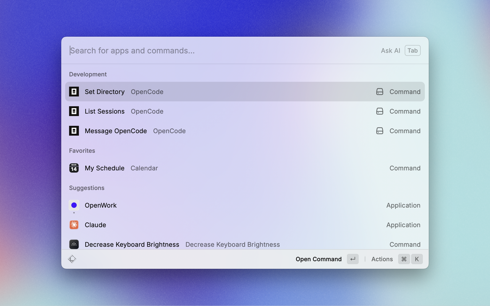

<div align="center">
  <h1>mcp-imessage</h1>
  <p>A macOS MCP server for reading iMessage data, searching conversations, looking up contacts, and rendering everything in a native-style embedded UI.</p>
  <p>
    
    
    
    
  </p>
</div>

`mcp-imessage` can:

- read recent iMessage threads
- fetch messages from a person or group chat
- search messages and conversations
- look up contacts from Contacts.app
- send iMessages, SMS messages, and file attachments
- render results in a native-style embedded UI

It is built in Rust for the server layer, with a small React/Vite app bundled into the binary for the UI.

## Screenshots

### Thread list


### Conversation view


### Search and contact views


## Why this repo exists

Most iMessage MCP experiments stop at raw JSON. This one is meant to be usable:

- fast read-only SQLite queries for message history
- Contacts lookup with caching and AppleScript fallback
- send support for direct chats and group chats
- an embedded UI resource that makes conversations easier to inspect inside MCP hosts

## What it uses

- `chat.db` at `~/Library/Messages/chat.db`
- Contacts data from macOS Contacts
- AppleScript via `osascript` for send actions and Contacts fallback
- MCP over stdio

## Requirements

- macOS
- Node.js 20+
- Rust stable
- Messages.app signed in to iMessage
- permission to access Messages data, Contacts, and Automation access for Messages.app when sending

## Full Disk Access

macOS protects `~/Library/Messages/chat.db`, so the `mcp-imessage` server process itself needs Full Disk Access to read message history reliably.

1. Open `System Settings`.
2. Go to `Privacy & Security` -> `Full Disk Access`.
3. Add and enable `mcp-imessage`.
4. This is the important part: grant access to the actual `mcp-imessage` binary, not just your MCP client.
5. If your MCP client launches `mcp-imessage` in a way that still inherits the host app's privacy boundary, also grant Full Disk Access to that host app.

Example:



Examples:

- If you run the binary directly, add the compiled `mcp-imessage` binary.
- If Claude Desktop, Codex, Terminal, iTerm, or another MCP host launches that binary for you, still make sure the `mcp-imessage` binary itself has access first.
- In some setups you may also need to add the host app, but that does not replace granting access to `mcp-imessage`.

After enabling Full Disk Access, fully restart the host app before testing again.

## Security notes

- Message database access is opened in read-only SQLite mode.
- Contacts database access is also opened in read-only SQLite mode.
- `messages_send` is disabled by default and is only exposed when `MCP_IMESSAGE_ENABLE_SEND=1` is set.
- AppleScript send and search actions pass user input through argv instead of interpolating raw values into script source.
- The UI build runs local `npm ci` during Cargo builds, so treat dependency updates as part of your trusted supply chain review.

## Quick start

```bash
git clone https://github.com/antondkg/mcp-imessage.git
cd mcp-imessage
cargo build --release
```

The Rust build automatically installs UI dependencies with `npm ci` the first time and bundles the frontend into `ui/dist/index.html`.

Then point your MCP client at the compiled binary:

```json
{
  "mcpServers": {
    "imessage": {
      "command": "/absolute/path/to/mcp-imessage/target/release/mcp-imessage"
    }
  }
}
```

Common config locations:

- Claude Desktop: `~/Library/Application Support/Claude/claude_desktop_config.json`
- Codex / local agent config: `~/.agents/mcp.json`
- Generic MCP clients: whatever config file your client uses for `mcpServers`

To enable sending support, set `MCP_IMESSAGE_ENABLE_SEND=1` in the environment for your MCP host before launching the server.

## Tools

### `messages_threads`

Lists recent conversation threads. For small result sets it also includes recent messages so hosts can render a preview immediately.

### `messages_fetch`

Fetches a conversation by:

- contact name
- participant phone number or email
- group chat identifier

Supports pagination with `before_timestamp` and `after_timestamp`.

### `messages_search`

Searches both:

- matching contact conversations
- matching message text

This makes it useful for both "show me Alex" and "find the message about invoices".

### `messages_send`

Sends:

- text
- file attachments
- text plus file attachments

Works with direct recipients and group chats.

### `contacts_search`

Searches Contacts by name, phone, or email.

### `contacts_me`

Returns the local user's contact card from Contacts.app.

## Development

### Run the UI by itself

```bash
cd ui
npm ci
npm run dev
```

### Build everything

```bash
cd ui
npm ci
npm run build

cd ..
cargo check
```

### Skip the automatic UI build

If you already built `ui/dist/index.html` and want Cargo to skip rebuilding it:

```bash
MCP_IMESSAGE_SKIP_UI_BUILD=1 cargo build
```

## Privacy and safety notes

- This project reads local macOS message data directly from the Messages SQLite database.
- It is intended for local use on your own machine.
- Nothing in this repo sends your message history to a remote service by default.
- Sending messages requires AppleScript automation access to Messages.app.

## Repo layout

```text
.
├── build.rs
├── src/
└── ui/
```

## Publish checklist

Before pushing this repo public:

1. Make sure your local MCP config points at your local binary path, not a private workspace path you do not want to expose.
2. Review git history if this repo started private and might contain earlier secrets or personal data.
3. Confirm the macOS permission prompts and setup instructions make sense on a clean machine.
4. Push to a public GitHub repo, then enable the included macOS CI workflow.

## License

[MIT](https://opensource.org/licenses/MIT)
